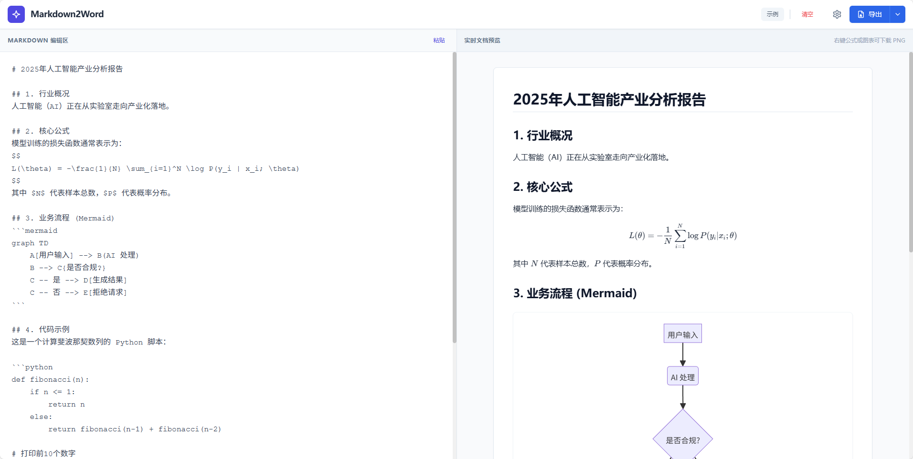

<div align="center">

# Markdown to Word Converter / Markdown转Word工具

<div>
  <a href="#english">🇺🇸 English</a> | 
  <a href="#中文">🇨🇳 中文</a>
</div>

<p align="center">
  <em>Choose your language / 选择您的语言</em>
</p>

</div>

<a name="english"></a>
## English Version

### Overview

A modern React application that converts Markdown documents to Word (.docx) format with rich formatting support.

<div align="center">
  
  <br/>
  <em>Application Interface Preview</em>
</div>

### Features

<div align="center">
  <table>
    <tr>
      <td align="center">📝 <strong>Markdown Support</strong></td>
      <td align="center">🧮 <strong>Math Expressions</strong></td>
      <td align="center">📊 <strong>Mermaid Diagrams</strong></td>
    </tr>
    <tr>
      <td align="center">Full Markdown syntax including headers, lists, code blocks, tables, and more</td>
      <td align="center">LaTeX math formula support using KaTeX</td>
      <td align="center">Render and convert Mermaid diagrams to images</td>
    </tr>
    <tr>
      <td align="center">💻 <strong>Code Highlighting</strong></td>
      <td align="center">📤 <strong>Export Formats</strong></td>
      <td align="center">👁️ <strong>Real-time Preview</strong></td>
    </tr>
    <tr>
      <td align="center">Syntax highlighting for code blocks</td>
      <td align="center">Export to Word (.docx), PDF, and HTML</td>
      <td align="center">Live preview of the converted document</td>
    </tr>
  </table>
</div>

### Tech Stack

- **Frontend**: React 19 + TypeScript
- **Build Tool**: Vite
- **Markdown Processing**: React Markdown with remark plugins
- **Word Export**: docx library
- **PDF Export**: jsPDF + html2canvas
- **Styling**: CSS Modules

### Getting Started

#### Prerequisites

- Node.js (version 16 or higher)
- npm or yarn

#### Installation

1. Clone the repository:
   ```bash
   git clone <repository-url>
   cd markdown2word
   ```

2. Install dependencies:
   ```bash
   npm install
   ```

3. Start the development server:
   ```bash
   npm run dev
   ```

4. Open your browser and navigate to `http://localhost:5173`

#### Building for Production

```bash
npm run build
```

### Usage

1. Enter or paste your Markdown content in the editor
2. Use the preview panel to see the formatted output
3. Click the export buttons to download in your preferred format:
   - **Word (.docx)**: Full formatting preservation
   - **PDF**: Print-ready document
   - **HTML**: Web-friendly format

### Project Structure

```
markdown2word/
├── components/          # React components
│   ├── ExportButtons.tsx    # Export functionality
│   ├── Icon.tsx             # Icon components
│   ├── LoadingContext.tsx   # Loading state management
│   └── MermaidBlock.tsx     # Mermaid diagram rendering
├── App.tsx              # Main application component
├── index.tsx            # Application entry point
├── types.ts             # TypeScript type definitions
└── vite.config.ts       # Vite configuration
```

### Contributing

1. Fork the repository
2. Create a feature branch: `git checkout -b feature/amazing-feature`
3. Commit your changes: `git commit -m 'Add amazing feature'`
4. Push to the branch: `git push origin feature/amazing-feature`
5. Open a pull request

### License

This project is licensed under the MIT License.

<p align="right">
  <a href="#markdown-to-word-converter--markdown转word工具">⬆️ Back to top</a>
</p>

---

<a name="中文"></a>
## 中文版本

### 项目概述

一个现代化的React应用程序，可将Markdown文档转换为Word (.docx) 格式，支持丰富的格式化功能。

<div align="center">
  
  <br/>
  <em>应用界面预览</em>
</div>

### 功能特性

<div align="center">
  <table>
    <tr>
      <td align="center">📝 <strong>Markdown支持</strong></td>
      <td align="center">🧮 <strong>数学公式</strong></td>
      <td align="center">📊 <strong>Mermaid图表</strong></td>
    </tr>
    <tr>
      <td align="center">完整的Markdown语法，包括标题、列表、代码块、表格等</td>
      <td align="center">使用KaTeX支持LaTeX数学公式</td>
      <td align="center">渲染并转换Mermaid图表为图像</td>
    </tr>
    <tr>
      <td align="center">💻 <strong>代码高亮</strong></td>
      <td align="center">📤 <strong>导出格式</strong></td>
      <td align="center">👁️ <strong>实时预览</strong></td>
    </tr>
    <tr>
      <td align="center">代码块的语法高亮显示</td>
      <td align="center">支持导出为Word (.docx)、PDF和HTML</td>
      <td align="center">转换文档的实时预览功能</td>
    </tr>
  </table>
</div>

### 技术栈

- **前端**: React 19 + TypeScript
- **构建工具**: Vite
- **Markdown处理**: React Markdown与remark插件
- **Word导出**: docx库
- **PDF导出**: jsPDF + html2canvas
- **样式**: CSS Modules

### 快速开始

#### 环境要求

- Node.js (版本16或更高)
- npm 或 yarn

#### 安装步骤

1. 克隆仓库：
   ```bash
   git clone <仓库地址>
   cd markdown2word
   ```

2. 安装依赖：
   ```bash
   npm install
   ```

3. 启动开发服务器：
   ```bash
   npm run dev
   ```

4. 打开浏览器访问 `http://localhost:5173`

#### 生产环境构建

```bash
npm run build
```

### 使用方法

1. 在编辑器中输入或粘贴Markdown内容
2. 使用预览面板查看格式化输出
3. 点击导出按钮下载所需格式：
   - **Word (.docx)**: 完整格式保留
   - **PDF**: 打印就绪文档
   - **HTML**: 网页友好格式

### 项目结构

```
markdown2word/
├── components/          # React组件
│   ├── ExportButtons.tsx    # 导出功能
│   ├── Icon.tsx             # 图标组件
│   ├── LoadingContext.tsx   # 加载状态管理
│   └── MermaidBlock.tsx     # Mermaid图表渲染
├── App.tsx              # 主应用组件
├── index.tsx            # 应用入口点
├── types.ts             # TypeScript类型定义
└── vite.config.ts       # Vite配置
```

### 贡献指南

1. Fork 本仓库
2. 创建功能分支：`git checkout -b feature/新功能`
3. 提交更改：`git commit -m '添加新功能'`
4. 推送分支：`git push origin feature/新功能`
5. 提交 Pull Request

### 许可证

本项目采用 MIT 许可证。

<p align="right">
  <a href="#markdown-to-word-converter--markdown转word工具">⬆️ 返回顶部</a>
</p>
