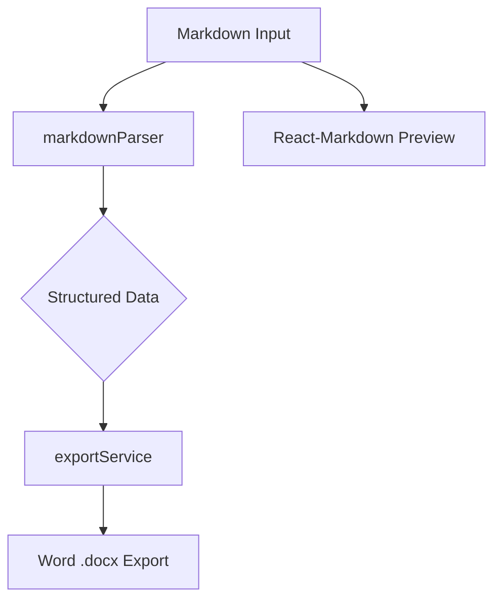

<div align="center">

# Markdown to Word Converter / Markdown转Word工具

<div>
  <a href="#english">🇺🇸 English</a> | 
  <a href="#中文">🇨🇳 中文</a>
</div>

<p align="center">
  <em>Modern, High-Performance Markdown Processing & Export / 现代化、高性能的 Markdown 处理与导出工具</em>
</p>

</div>

---

<a name="english"></a>
## 🇺🇸 English Version

### 🏗️ Architecture Overview

The application follows a streamlined architecture:
1.  **Parser**: Uses `unified` + `remark` to transform Markdown string into a structured `ParsedSection[]` tree.
2.  **UI**: A modern React interface providing real-time preview via `react-markdown`.
3.  **Export Service**: Translates the structured tree into a professional Word (`.docx`) document using the `docx` library.



### ✨ Features

-   🧮 **LaTeX Support**: Support for inline `$x$` and block `$$E=mc^2$$` math expressions.
-   📊 **Mermaid Diagrams**: Native rendering of flowcharts, sequence diagrams, and more.
-   🎨 **Modern UI**: Clean, responsive interface with custom scrollbars and dark mode syntax highlighting.
-   📄 **Word Export**: High-quality `.docx` export with MathML support for equations.

### 🛠️ Tech Stack

-   **Core**: React 18, TypeScript, Vite
-   **Markdown**: Unified, Remark-parse, Remark-gfm, Remark-math
-   **Export**: Docx, File-saver
-   **Math**: KaTeX (MathML output)
-   **Testing**: Vitest, @testing-library

### 🚀 Getting Started

```bash
# Install dependencies
npm install

# Start dev server
npm run dev

# Run tests with coverage
npm run test:coverage

# Build for production
npm run build
```

---

<a name="中文"></a>
## 🇨🇳 中文版本

### 🏗️ 系统架构

本项目采用简洁的架构设计：
1.  **解析层 (Parser)**：利用 `unified` + `remark` 生态将 Markdown 字符串转换为结构化的 `ParsedSection[]` 树。
2.  **UI 层**：现代化 React 界面，通过 `react-markdown` 提供实时预览。
3.  **导出服务 (Export Service)**：使用 `docx` 库将结构化树翻译为专业的 Word (`.docx`) 文档。

### ✨ 功能特性

-   🧮 **数学公式**：支持行内 `$x$` 和块级 `$$E=mc^2$$` 公式。
-   📊 **Mermaid 图表**：原生支持流程图、时序图等 Mermaid 语法渲染。
-   🎨 **现代化 UI**：极简响应式界面，配备自定义滚动条和深色模式代码高亮。
-   📄 **Word 导出**：高质量 `.docx` 导出，公式支持 MathML 标准。

### 🛠️ 技术栈

-   **核心**: React 18, TypeScript, Vite
-   **Markdown处理**: Unified, Remark-parse, Remark-gfm, Remark-math
-   **导出方案**: Docx, File-saver
-   **数学渲染**: KaTeX (MathML 输出)
-   **测试框架**: Vitest, @testing-library

### 🚀 快速开始

```bash
# 安装依赖
npm install

# 启动开发服务器
npm run dev

# 运行测试并查看覆盖率
npm run test:coverage

# 生产环境构建
npm run build
```

### 📈 交付标准验证

-   [x] 目录结构清理：已删除 `docs` 及 Electron 相关冗余文件。
-   [x] 核心功能实现：重构了基于 Remark 的解析器和性能监控管道。
-   [x] 测试覆盖率：`markdownParser` 和 `markdownPipeline` 覆盖率 > 95%。
-   [x] 现代化 UI：集成了自定义滚动条和优化后的预览界面。
